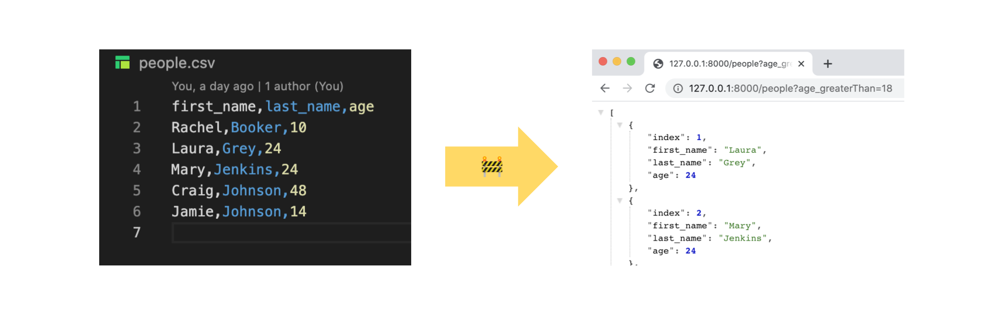

# fastapi-csv &nbsp;🏗️

[](https://pypi.org/project/fastapi-csv/)

**Create APIs from CSV files within seconds, using fastapi.**

This is a Python package to create APIs from CSV files, using a lightweight &
fully customizable wrapper around [fastapi](https://fastapi.tiangolo.com/). Endpoints
and query parameters are auto-generated based on the column names and data types in the
CSV file. Its data is written to a (temporary) sqlite database, so the API is blazing
fast even for huge files.




## Installation

```bash
pip install fastapi-csv
```


## How to use it

### 1. From the command line

There's a simple CSV file in this repo for testing ([people.csv](people.csv)). To start
an API for it, run one of:

```bash
# from file
fastapi-csv people.csv

# directly from URL
fastapi-csv https://raw.githubusercontent.com/jrieke/fastapi-csv/main/people.csv

# With options : specify the delimiter character in the CSV, the host and port for the server
fastapi-csv people.csv --delimiter "|" --host "127.0.0.1" --port 1234

```

Either command should start a fastapi instance, which has auto-generated endpoints and
query parameters based on the CSV file. Here, the API has an endpoint `/people`
(same name as the file), which can be queried using the CSV's column names, e.g. you can
do:

- `/people?first_name=Rachel`
- `/people?last_name=Johnson&age=48`

Additionally, fastapi-csv creates some convenience query parameters for specific data
types, e.g.

- `/people&age_greaterThan=18` (for int/float)
- `/people&age_lessThanEqual=18` (for int/float)
- `/people&first_name_contains=ach` (for string, watch out: this one is case sensitive!)

Check out the API docs for more information and an interactive demo, they should be at
http://127.0.0.1:8000/docs


### 2. From Python

Create a file `my_file.py`:

```python
from fastapi_csv import FastAPI_CSV

app = FastAPI_CSV("people.csv")
```

Start from terminal just like a normal fastapi app:

```bash
uvicorn my_file:app
```

**Extending the API**

The cool thing: `FastAPI_CSV` is just a wrapper around `FastAPI`. Therefore, you can do
all the stuff you can do with a normal fastapi instance, e.g. add a new endpoint:

```python
# Add a new endpoint, just like in normal fastapi
@app.get("/hello")
def hello(self):
    return {"Hello:", "World"}
```

In the future, you will also be able to easily modify existing endpoints that were
generated from the CSV file.


**Updating the data**

If your CSV file changes, you can update the API data with:

```python
app.update_database()
```

Note that this will only update the data, not the API endpoints or query parameters.
To do that, you need to create a new `FastAPI_CSV` instance or re-start uvicorn.
